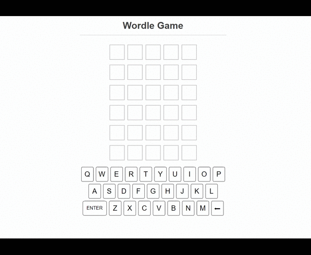
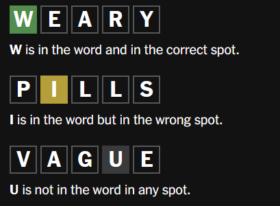

# Wordle-Clone

### This is my first project from Josh Comeau's react course called [Joy of React](https://www.joyofreact.com/).



# How to play the game

- ### You have six (6) attempts to guess a five (5) letter word.
- ### Each guess must be a five (5)-letter word.
- ### The color of the tiles will change to show how close your guess was to the word.

## Examples:



The image above is taken from the official wordle [site.](https://www.nytimes.com/games/wordle/index.html/)

# Local Development

### 1. To clone this repository, type in your terminal (or copy)

```
git clone https://github.com/scott-gianan/wordle-clone.git
```

### 2. Change to the wordle-clone directory

```
cd wordle-clone
```

### 3. Install the necessary dependencies

```
npm install
```

### 4. Run this repository locally

```
npm run dev
```

### 5. Head on to your browser address bar and type (or copy the link):

```
http://localhost:5173/
```

---
